# Optimizing Telemarketing Campaigns with Azure Machine Learning
**Author:** Marco Flavio Delgado Martinez

## Overview
In my experience working with Data Engineering and Machine Learning operations, bridging the gap between raw data and actionable business strategy is what drives real value. This project builds and deploys a production-ready machine learning model to optimize telemarketing campaigns for a financial institution. 

By analyzing a bank marketing dataset, the model predicts a client's propensity to subscribe to a term deposit. Instead of cold-calling blindly, the business can use this REST API to prioritize high-value leads in real-time or via automated batch pipelines, reducing call center costs and boosting conversion rates. 

To ensure strict data governance and secure access, I deployed the best-performing Automated ML classification model via an authenticated REST API using Azure Container Instances (ACI). I also enabled Application Insights for monitoring, documented the endpoint using Swagger UI, and published an active ML pipeline to automate model retraining.

## Architectural Flow
Below is the architectural flow of the project, mapping the data from ingestion to a securely consumed endpoint.

* 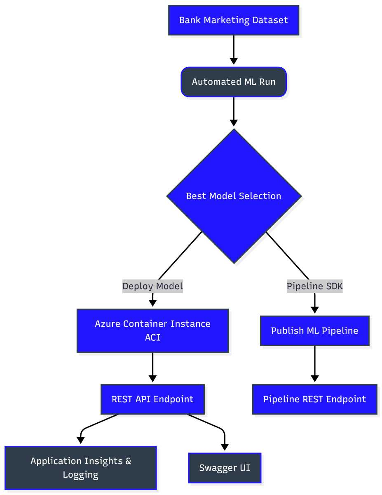

## Key Implementation Steps

### 1. Data Ingestion & Automated ML
The dataset was securely registered in the Azure workspace. I configured an Automated ML run to evaluate various classification algorithms, optimizing for `AUC_weighted` to account for class imbalance.

* 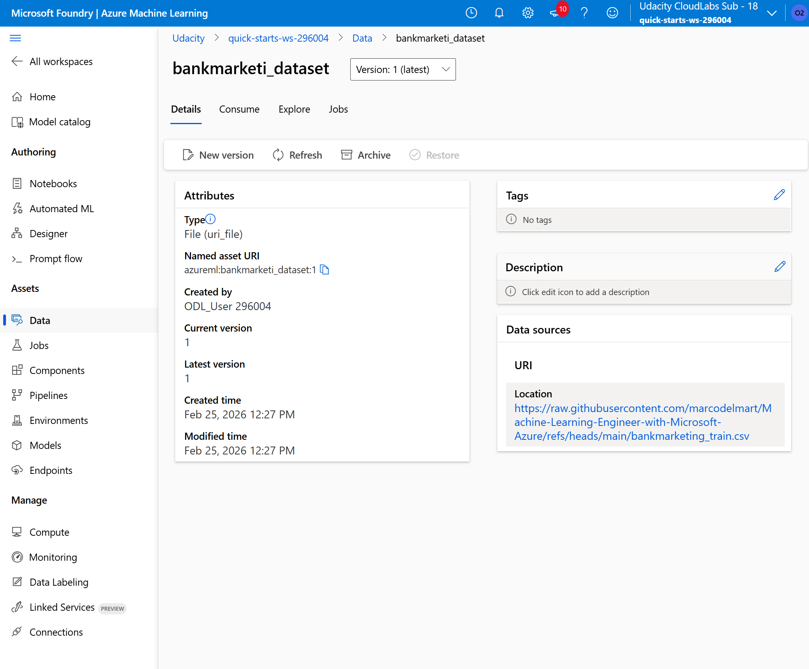
* 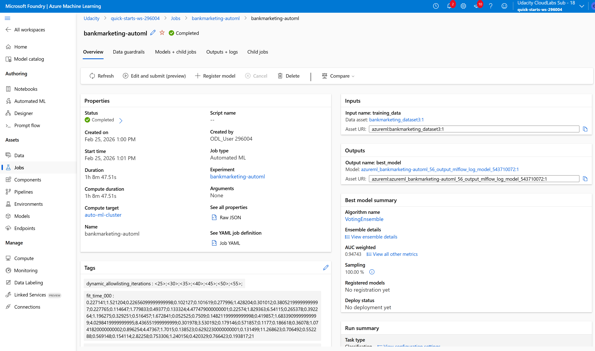
* 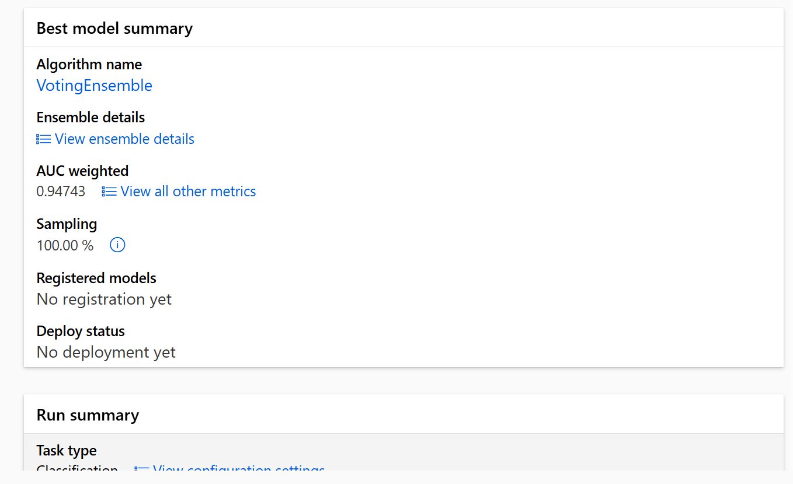

### 2. Deployment & Observability
The top-performing model was deployed as a REST web service using Azure Container Instances (ACI). Key-based authentication was strictly enforced to protect data payload integrity. I programmatically enabled Application Insights to monitor HTTP traffic and container health.

* 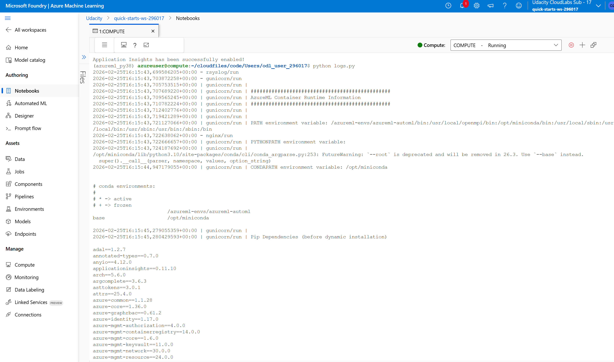
* 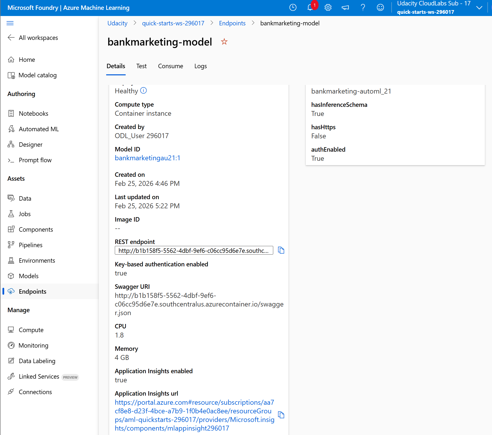

### 3. API Documentation (Swagger)
To ensure smooth handoffs to front-end and marketing teams, I ran a local Docker container serving the model's Swagger UI schema, detailing the `/score` POST methods and expected JSON arrays.

* 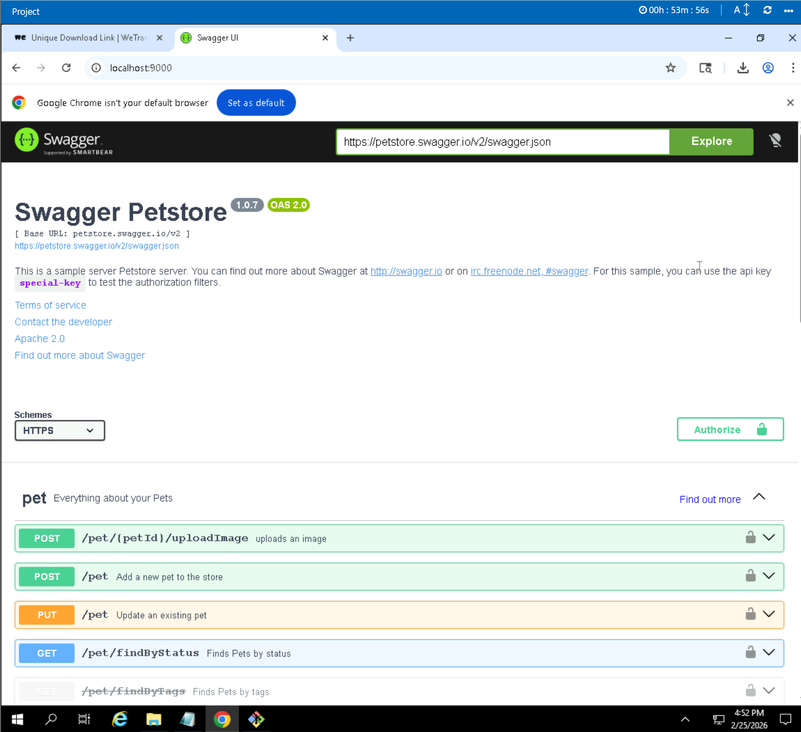

### 4. Consuming the Endpoint
To validate the architecture, I fired an authenticated JSON payload containing sample client data at the REST API and successfully received an array of predictions.

``` bash
python endpoint.py
```

* 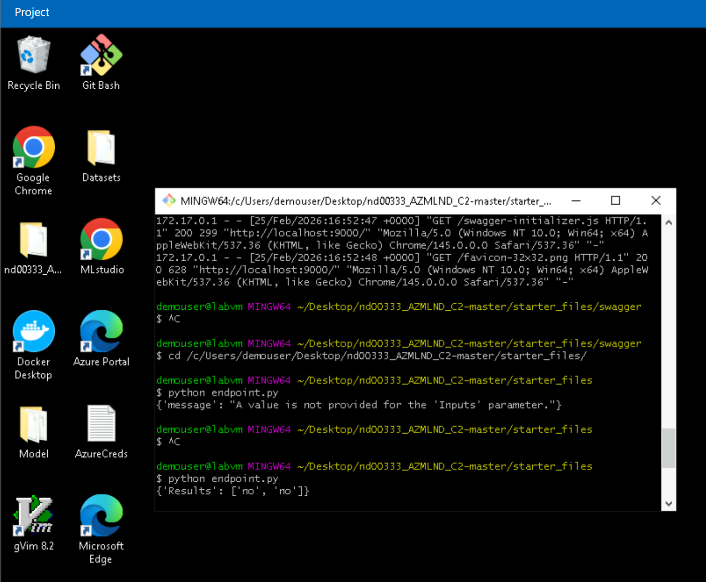

### 5. Automating the ML Pipeline
To scale the solution, I used the Azure ML Python SDK to create, run, and publish an ML Pipeline. This exposes a dedicated REST endpoint specifically for triggering pipeline runs, allowing the business to seamlessly retrain the model when new marketing data arrives.

* 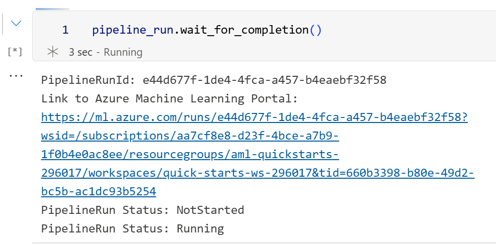
* 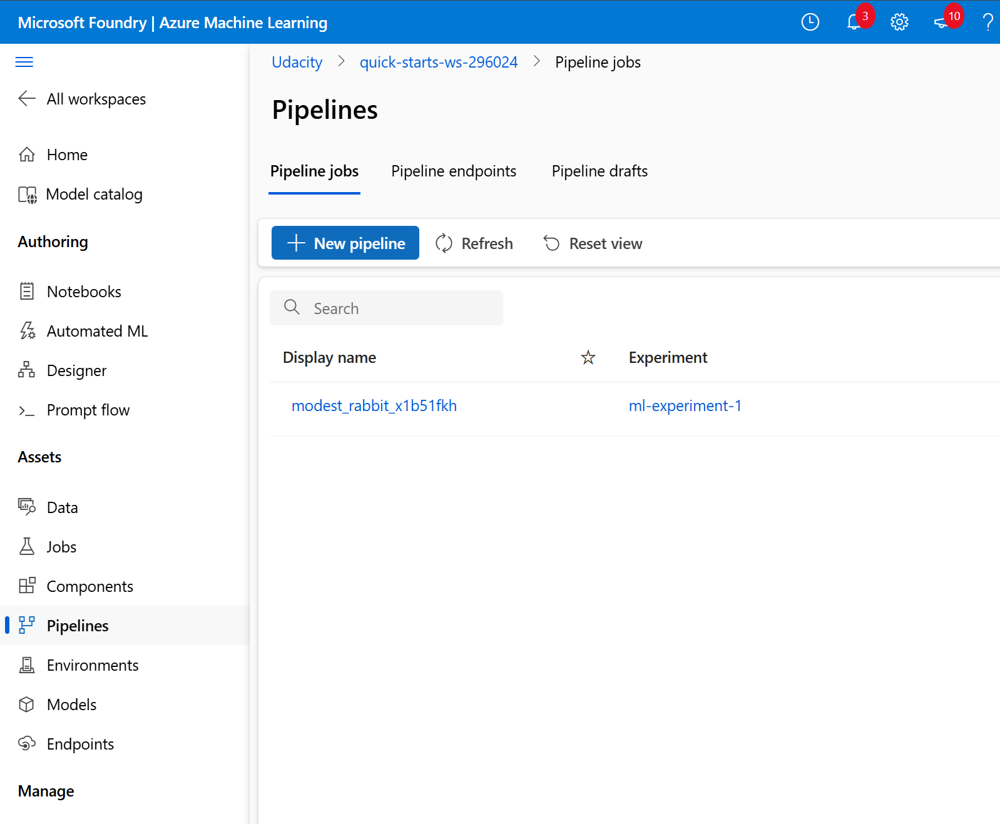
* 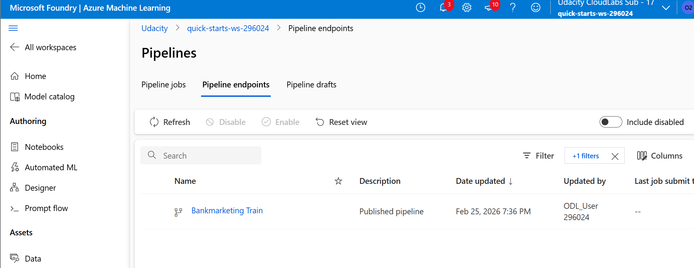
* 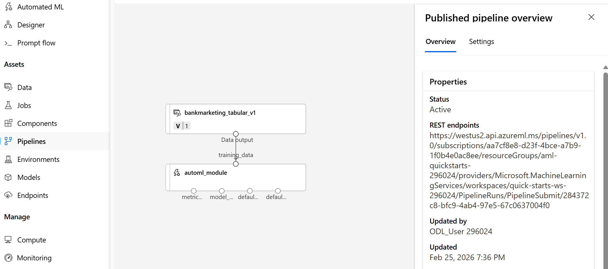
* 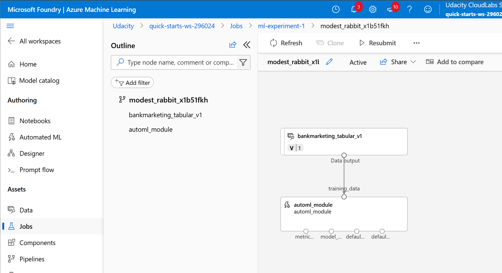

## Future Improvements
While the current ACI deployment is excellent for agile development and testing, migrating to a production-grade enterprise environment requires a more robust architecture. 

In the future, I recommend upgrading the deployment target to **Azure Kubernetes Service (AKS)**. AKS provides superior horizontal scalability, advanced load balancing, and stricter security controls (like tighter RBAC integration), which are absolute standards when handling financial data and unpredictable API traffic from global marketing teams.

## Video Demonstration


